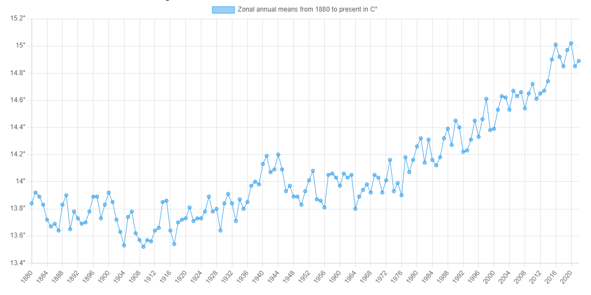

# Graphing CSV data with Chart.js

## Table of contents

- [Overview](#overview)
  - [About this project](#about-this-project)
  - [Screenshots](#screenshots)
  - [Useful resources](#useful-resources)
- [My process](#my-process)
  - [Workflow](#workflow)
  - [What I learned](#what-i-learned)
  - [Continued development](#continued-development)
- [Acknowledgements](#acknowledgements)
- [Author](#author)

## Overview

### About this project

> This JavaScript project is about visualizing a CSV file using Chart.js. The program loads, parses and graphs the CSV data. As a result you can see a line chart showing the progression of global surface temperatures from 1880 to present.  

### Screenshots



### Useful resources

Goddard Institute for Space Studies - [Global surface temperature data](https://data.giss.nasa.gov/gistemp/)  
Chart.js - [JavaScript charting library](https://www.chartjs.org/)  
Chart.js - [Getting started](https://www.chartjs.org/docs/latest/getting-started/)  

## My process

### Workflows

CSV datafile:

- Load CSV file  
- Parse CSV data  

Chart.js library:  

- Import Chart.js by CDN  
- Graph CSV data with Chart.js to HTML Canvas  
- Chart.js styling options  

### What I learned

- [async function](https://developer.mozilla.org/en-US/docs/Web/JavaScript/Reference/Statements/async_function) (MDN)

  ```javascript
  async function getData() {
    const response = await fetch('ZonAnn.Ts+dSST.csv');
    const data = await response.text();
    console.log(data);
  }
  ```

### Continued development

- try to graph a different dataset of this web page  
- fetch the current CSV file from NASA API (and trim empty last line)  
- Graphing multiple lines to chart  
- CSS: When increasing the window size: Chart size doesn't change.  

## Acknowledgements

This project is based on this really helpful YouTube tutorial: [Tabular Data - Working With Data & APIs in JavaScript](https://www.youtube.com/watch?v=5-ptp9tRApM&list=PLRqwX-V7Uu6YxDKpFzf_2D84p0cyk4T7X&index=6).  
Thank you [Coding Train](https://www.youtube.com/@TheCodingTrain). :heart:  

## Author

Created by [@Thomas Ulrich](https://github.com/TomUlrich) - feel free to contact me.
